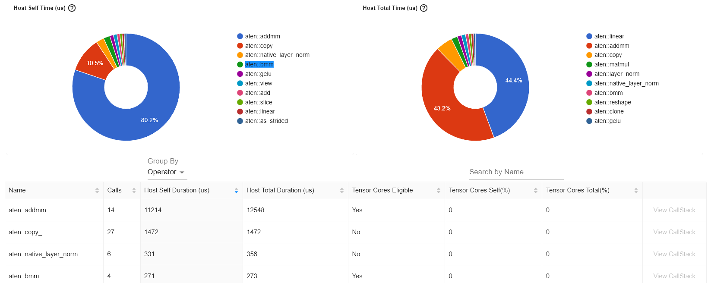
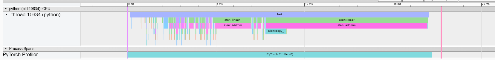

# TinyBERT Experiment

## How to run?

```bash
mkdir -p ~/miniconda3
wget https://repo.anaconda.com/miniconda/Miniconda3-latest-Linux-x86_64.sh -O ~/miniconda3/miniconda.sh
bash ~/miniconda3/miniconda.sh -b -u -p ~/miniconda3
rm -rf ~/miniconda3/miniconda.sh
~/miniconda3/bin/conda init bash
source ~/.bashrc


conda create -y -n torch-mlir python=3.11
conda activate torch-mlir
pip install --pre torch-mlir -f https://llvm.github.io/torch-mlir/package-index/ --extra-index-url https://download.pytorch.org/whl/nightly/cpu
pip install transformers
```

```
mkdir -p ~/mlir
cd ~/mlir
wget https://github.com/llvm/llvm-project/releases/download/llvmorg-16.0.0/clang+llvm-16.0.0-x86_64-linux-gnu-ubuntu-18.04.tar.xz
tar -xvf clang+llvm-16.0.0-x86_64-linux-gnu-ubuntu-18.04.tar.xz

# MLIR will be available at ~/mlir/clang+llvm-16.0.0-x86_64-linux-gnu-ubuntu-18.04/bin/mlir-opt
```

```bash
```

## x86 execution

Using the following system:

```
model name:          AMD Ryzen 9 3900X 12-Core Processor
Stepping:            0
CPU MHz:             3792.888 (NOTE: CPUMHz/667 = 5.68 times faster)
BogoMIPS:            7585.77
Hypervisor vendor:   Microsoft
Virtualization type: full
L1d cache:           32K
L1i cache:           32K
L2 cache:            512K
L3 cache:            16384K
```

Model compiled mlir>llvm>object using `mlir-opt`, `mlir-translate`, `clang -O3`

```
Time taken: 0.914677 seconds
Time taken: 0.909171 seconds
Time taken: 0.896614 seconds
Time taken: 0.897428 seconds
Time taken: 0.888495 seconds
```

I extrapolate that running this on the board would take around 5.11 seconds.
From results below around 70-80% of the runtime belongs to matmuls.
Which indicates that the Pynq-Z2 board would spend ~3.83seconds on matmuls.


## Runtime Breakdown using torch.profile

Using the following system:

```
model name:          AMD Ryzen 9 3900X 12-Core Processor
Stepping:            0
CPU MHz:             3792.888
BogoMIPS:            7585.77
Hypervisor vendor:   Microsoft
Virtualization type: full
L1d cache:           32K
L1i cache:           32K
L2 cache:            512K
L3 cache:            16384K
```

- aten::addmm is the most expensive layer in the model.
- It in some runs 80.6% of the total runtime.
- Total runtime is estimated to be around 16.9ms batch size of 2.
- profiling was done using schedule

```
---------------------------  ------------  ------------  ------------  ------------  ------------  ------------  
                       Name    Self CPU %      Self CPU   CPU total %     CPU total  CPU time avg    # of Calls  
---------------------------  ------------  ------------  ------------  ------------  ------------  ------------  
                aten::addmm        71.11%       9.037ms        81.82%      10.398ms     742.714us            14  
                aten::copy_        11.73%       1.491ms        11.73%       1.491ms      55.222us            27  
    aten::native_layer_norm         3.74%     475.000us         3.84%     488.000us      81.333us             6  
                  aten::bmm         2.27%     289.000us         2.28%     290.000us      72.500us             4  
                  aten::add         1.45%     184.000us         1.45%     184.000us      26.286us             7  
                 aten::gelu         1.27%     161.000us         1.27%     161.000us      53.667us             3  
               aten::linear         1.05%     133.000us        84.51%      10.740ms     767.143us            14  
                 aten::view         0.98%     124.000us         0.98%     124.000us       2.255us            55  
         aten::index_select         0.57%      73.000us         0.76%      97.000us      32.333us             3  
```





### aten::linear

https://pytorch.org/docs/stable/generated/torch.nn.Linear.html

Linear(in_features, out_features, bias=True)

### aten::addmm

https://pytorch.org/docs/stable/generated/torch.addmm.html

addmm(input, mat1, mat2, *, beta=1, alpha=1, out=None) → Tensor

